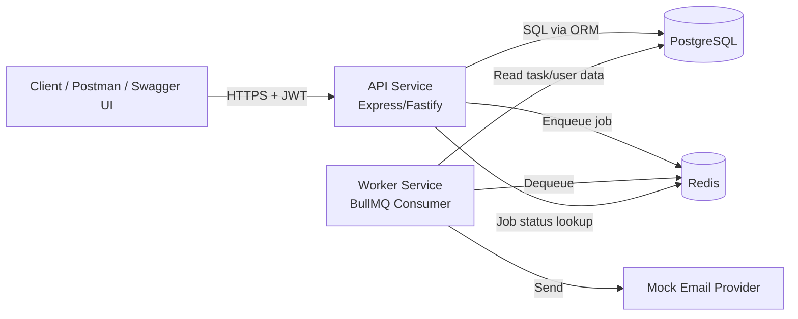
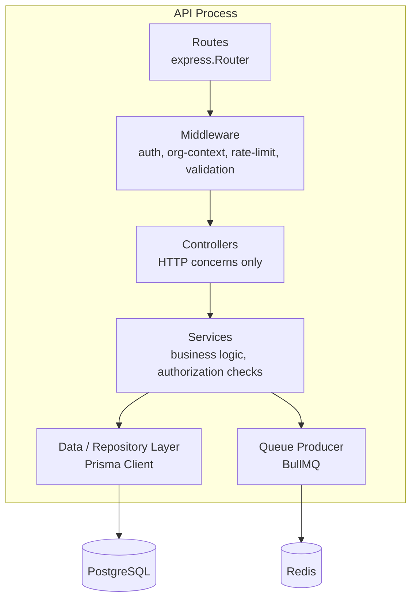
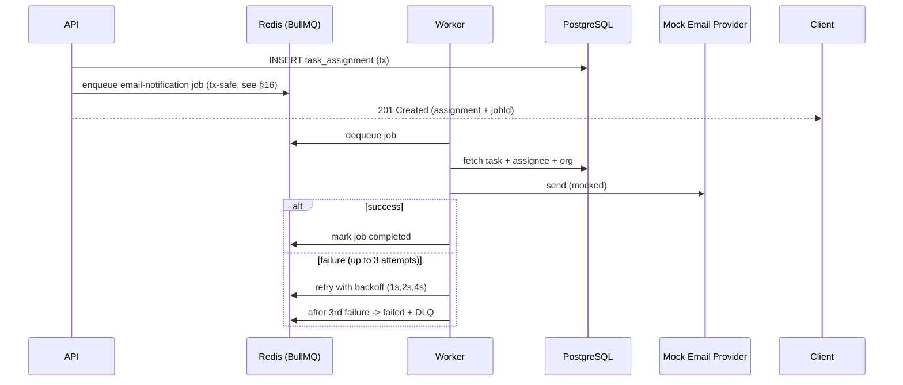
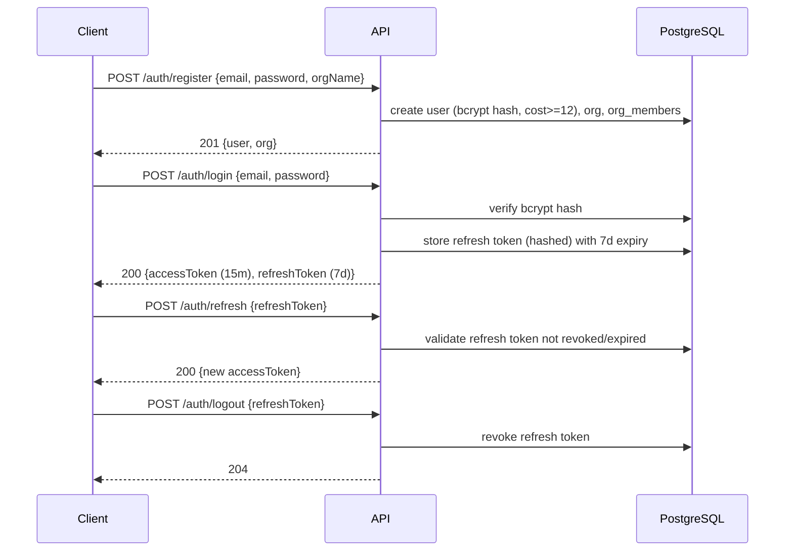
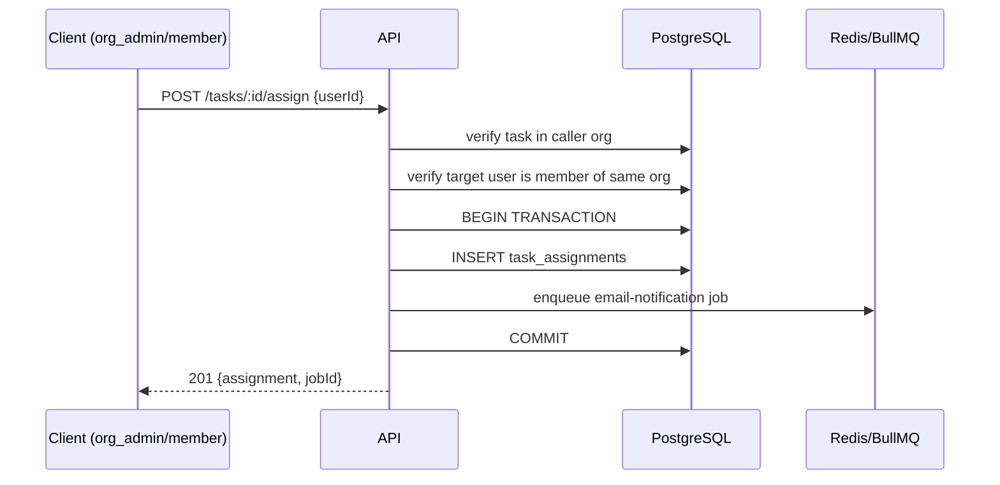
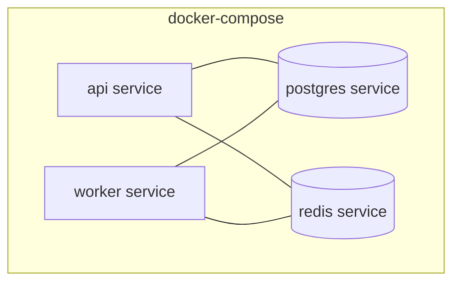

# TaskFlow — Architecture Document

## 1. Project Overview

TaskFlow is a multi-tenant backend for a lightweight project management system. Users belong to **organizations**, create **projects**, manage **tasks**, assign work to teammates, and receive **asynchronous email notifications** when they are assigned a task. The system is built to demonstrate secure multi-tenant isolation, clean layered architecture, sound relational database design, reliable background job processing, and production-readiness — the exact evaluation criteria of the TaskFlow assignment brief.

## 2. Problem Statement

Traditional single-tenant task trackers do not model organizational boundaries. TaskFlow must guarantee that:

- Every piece of data (projects, tasks, comments, assignments) is strictly scoped to the organization that owns it.
- Authenticated users can never read, modify, or infer the existence of another organization's data, even if they manipulate request payloads.
- Task assignment triggers a notification without blocking the API response, and remains consistent even if the queue is temporarily unavailable.

## 3. Functional Requirements (from assignment)

| # | Requirement | Source |
|---|---|---|
| 1 | User registration & login | Task 02 |
| 2 | JWT access + refresh token authentication | Task 02 |
| 3 | Organization-scoped RBAC (`org_admin`, `member`) | Task 02 |
| 4 | Full CRUD for projects, scoped to org | Task 03 |
| 5 | Full CRUD for tasks, scoped to project → org | Task 03 |
| 6 | Task filtering (status, priority, assignee, due-date range) + pagination | Task 03 |
| 7 | Assign/unassign a user to a task (same org only) | Task 03 |
| 8 | Project dashboard — task counts by status | Task 03 |
| 9 | Background email notification on assignment (BullMQ) | Task 04 |
| 10 | Job status endpoint `GET /jobs/:id` | Task 04 |
| 11 | Automated unit + integration tests | Task 05 |
| 12 | OpenAPI/Swagger + Postman/Bruno collection | Task 05 |

## 4. Non-Functional Requirements

- **Security**: bcrypt (cost ≥ 12), JWT TTLs (15 min access / 7 day refresh), rate-limited auth endpoints (10 req/min/IP), strict tenant isolation, no sensitive data leakage in errors.
- **Reliability**: background jobs retried 3× with exponential backoff (1s → 2s → 4s), dead-letter queue after exhaustion, assignment consistency even under enqueue failure.
- **Maintainability**: layered Route → Controller → Service → Data architecture, migration-based schema evolution, typed validation (Zod).
- **Observability**: structured logging, job status inspection, health checks.
- **Portability**: single `docker-compose up` brings up API, Worker, PostgreSQL, and Redis.

*(Non-functional targets such as specific latency/throughput numbers are not specified in the PDF; they are treated below as reasonable implementation decisions, not assignment requirements.)*

## 5. Technology Stack

| Layer | Choice | Notes |
|---|---|---|
| Runtime | Node.js 20 LTS + TypeScript | Assignment-mandated language family |
| Web framework | Express (or Fastify) | Assignment-mandated; see `DECISIONS.md` |
| ORM | Prisma | Assignment allows Prisma/TypeORM/Drizzle; see `DECISIONS.md` |
| Database | PostgreSQL 16 | Assignment-mandated; SQLite/Mongo/BaaS explicitly disallowed |
| Queue | Redis 7 + BullMQ | Assignment-mandated |
| Validation | Zod | Assignment-mandated for TS implementations |
| Auth | JWT (access + refresh), bcrypt | Assignment-mandated |
| Containerization | Docker Compose | Assignment-mandated: API, Worker, Postgres, Redis services |
| Testing | Vitest/Jest + Supertest | Implementation decision |
| API docs | OpenAPI 3.0 + Swagger UI | Assignment-mandated |

## 6. High-Level Architecture



**Services (docker-compose, as required by Task 04):**
1. `api` — stateless HTTP service.
2. `worker` — BullMQ consumer processing `email-notification` jobs.
3. `postgres` — primary datastore.
4. `redis` — queue broker + job state.

## 7. Component Architecture (Route → Controller → Service → Data)



- **Routes**: declare HTTP method + path, attach middleware chain, delegate to controller.
- **Controllers**: parse/validate request (Zod schema), call service, shape HTTP response. No business logic.
- **Services**: enforce authorization (role checks, org scoping), orchestrate repository calls and queue enqueueing inside transactions where required.
- **Data/Repository layer**: Prisma models; all queries are parameterized (no raw string SQL), preventing injection by construction.

## 8. API Service Architecture

- Stateless; horizontally scalable behind a load balancer.
- JWT middleware decodes the access token and attaches `req.auth = { userId, orgId, role }` derived **only** from the verified token — never from the request body or query string.
- A dedicated `orgContext` middleware re-reads the user's current `org_members` row to confirm role/membership, guarding against stale or tampered claims after role changes.
- Rate limiting middleware (e.g. `express-rate-limit` backed by Redis) applied specifically to `/auth/*` routes: 10 requests/minute/IP, as mandated.

## 9. Worker Architecture

- Separate Node.js process, same codebase/image, different entrypoint (`worker.ts`).
- Subscribes to the `email-notifications` BullMQ queue.
- Job payload: `{ taskAssignmentId, taskId, assigneeId, orgId }` — never trusts extra fields; re-fetches authoritative data from PostgreSQL before "sending" the mock email.
- Configured with:
  - `attempts: 3`
  - `backoff: { type: 'exponential', delay: 1000 }` → 1s, 2s, 4s
  - On final failure, BullMQ moves the job to a **failed** state; a queue event listener additionally moves the payload to a `email-notifications-dlq` queue for inspection, per the assignment's dead-letter requirement.



## 10. PostgreSQL Architecture

- One schema (`public`), one database, tenant isolation enforced **logically** via `org_id` foreign keys and mandatory `WHERE org_id = :authOrgId` filters in every query — not via separate schemas/databases per tenant (see §16 rationale).
- All tables use UUID primary keys (`gen_random_uuid()`), avoiding sequential-ID enumeration attacks across tenants.
- Enums implemented as native PostgreSQL `ENUM` types: `task_status` (`todo`, `in_progress`, `review`, `done`) and `task_priority` (`low`, `medium`, `high`, `urgent`).
- Full schema detail in `DATABASE.md`.

## 11. Redis / BullMQ Architecture

- Redis used exclusively as the BullMQ broker (and, optionally, the rate-limiter store).
- Queue: `email-notifications`. Job IDs are returned to the client via the assignment response and are the same IDs used by `GET /jobs/:id`.
- Job states surfaced by the API: `pending` (waiting/delayed in BullMQ), `active`, `completed`, `failed` — mapped from BullMQ's internal states to the assignment's required vocabulary.

## 12. Authentication Flow



## 13. Authorization / RBAC Flow

- Two roles, scoped **per organization** via `org_members.role`: `org_admin`, `member`.
- Authorization is enforced in the **service layer**, not the route layer, so it is unit-testable independent of HTTP.
- Rule matrix:

| Action | member | org_admin |
|---|---|---|
| Create/read/update own-org projects | ✅ | ✅ |
| Delete project | ❌ | ✅ |
| Manage org members | ❌ | ✅ |
| CRUD tasks in own-org projects | ✅ | ✅ |
| Assign/unassign tasks | ✅ | ✅ |

## 14. Multi-Tenant Isolation Strategy

**This is the most security-critical part of the system.** Two rules are enforced everywhere:

1. **`org_id` is only ever derived from the verified JWT / server-side `org_members` lookup — never from client input.** Even if a request body, query string, or path parameter includes an `org_id` or references a resource ID, the service layer re-derives the caller's org from `req.auth.orgId` and uses it as a mandatory filter.
2. **Every repository query touching a tenant-owned table includes `org_id` (directly, or transitively via a join to `projects.org_id`) in its `WHERE` clause.** There is no "trust the ID" code path.

**Why client-provided `org_id` cannot be trusted:** a client is fully capable of sending an arbitrary `org_id` value in a JSON body or query parameter — that value proves nothing about which organization the authenticated user actually belongs to. Trusting it would let any authenticated user read or mutate another organization's data simply by changing a field in the request (an IDOR / broken-object-level-authorization vulnerability). The only trustworthy source of tenant identity is server-side state established at authentication time: the JWT is cryptographically signed by the server, and the `org_members` row is read directly from the database — neither can be forged by the client.

**Enforcement pattern (repository layer, illustrative):**

```ts
// Service layer — org scope is injected, not accepted from the request body
async function getTask(taskId: string, authOrgId: string) {
  const task = await prisma.task.findFirst({
    where: { id: taskId, project: { orgId: authOrgId } },
  });
  if (!task) throw new NotFoundError('TASK_NOT_FOUND'); // 404, not 403, to avoid confirming existence
  return task;
}
```

**Cross-tenant access outcome:** per the assignment, an attempt to access a resource belonging to another organization must return **403 Forbidden** and must not leak resource data. TaskFlow implements this as: if the resource does not exist *within the caller's org scope*, the query returns no row → the service raises a `FORBIDDEN` (403) error with a generic message (`"You do not have access to this resource"`) and no resource fields in the payload. (Returning 404 vs 403 is a documented trade-off in `DECISIONS.md`; the assignment explicitly requires 403 for this class of failure, so 403 is used for any resource-ID-guessing attempt across orgs.)

## 15. Task Assignment + Notification Flow



## 16. Background Job Lifecycle & Consistency Strategy

**Requirement:** the assignment endpoint must persist the assignment and enqueue the job before responding, without leaving the assignment in an inconsistent state if enqueueing fails.

**Chosen strategy: transactional outbox pattern, simplified.**

1. Open a PostgreSQL transaction.
2. Insert the `task_assignments` row.
3. Attempt to enqueue the BullMQ job **inside** the same request handler, after the DB write but before commit is finalized in application logic (BullMQ's Redis write is not part of the SQL transaction — Redis and PostgreSQL cannot share a distributed transaction).
4. **If enqueueing fails:** the code catches the error, still commits the assignment (the assignment itself is valid domain state — a user *is* assigned), and writes a `notification_status = 'enqueue_failed'` marker on the assignment row (implementation column) instead of rolling back the whole operation. A scheduled reconciliation job (or an admin-triggered replay endpoint) scans for `enqueue_failed` rows and re-enqueues them.
5. This avoids the worse failure mode of silently losing a *successful* assignment just because Redis was briefly unavailable, while still guaranteeing every assignment eventually gets a notification attempt.

Alternative strategies considered (and rejected) are documented in `DECISIONS.md` (2-phase commit, synchronous email send, best-effort fire-and-forget with no tracking).

**Job status states surfaced by `GET /jobs/:id`:** `pending → active → completed`, or `pending → active → failed` (after 3 exhausted retries, additionally routed to the dead-letter queue).

## 17. Error-Handling Strategy

- Centralized Express/Fastify error-handling middleware converts all thrown errors into the assignment's mandated shape:

```json
{ "error": "Task not found", "code": "TASK_NOT_FOUND", "details": {} }
```

- Custom error classes (`NotFoundError`, `ForbiddenError`, `ValidationError`, `ConflictError`) each map to an HTTP status and a stable `code`.
- Internal/unexpected errors are logged with full detail server-side but returned to the client as a generic `500 { "error": "Internal server error", "code": "INTERNAL_ERROR", "details": {} }` — no stack traces, SQL, or internals ever reach the client (see `SECURITY.md`).

## 18. Validation Strategy

- Every request body/query/params object is parsed through a Zod schema at the controller boundary before reaching services.
- Failures produce `400` with `code: "VALIDATION_ERROR"` and a `details` object listing field-level issues.
- Validation schemas double as the source of truth for OpenAPI request-body generation (kept in sync manually or via `zod-to-openapi`, an optional bonus tooling decision).

## 19. Testing Architecture

See `TESTING.md` for full detail. Summary: unit tests for pure logic (auth helpers, pagination, assignment validation) run against no external dependencies; integration tests run against a dedicated Dockerized Postgres/Redis test instance with per-test transactional rollback or a truncate-between-tests strategy.

## 20. Docker Architecture



- `docker-compose.yml` defines all four required services with named volumes for Postgres persistence, healthchecks, and a shared `.env` file.
- `api` and `worker` share one Docker image with different `CMD`/entrypoints to avoid drift between the two runtime code paths.

## 21. Security Architecture

Full detail in `SECURITY.md`. Highlights: bcrypt cost ≥ 12, short-lived signed JWTs, hashed refresh tokens with DB-backed revocation, per-IP auth rate limiting, strict org-scoped queries, parameterized queries via ORM (no SQL injection surface), no secrets in source control (`.env.example` only).

## 22. Scalability Considerations

- API is stateless and can run multiple replicas behind a load balancer; JWTs avoid server-side session affinity.
- Worker can scale horizontally — BullMQ safely distributes jobs across multiple worker instances via Redis.
- Database indexes (see `DATABASE.md`) support the required filter/pagination patterns at scale.
- Redis can be moved to a managed cluster without code changes (connection string only).

## 23. Production-Readiness Considerations

- Structured logging (e.g. pino) with request IDs for traceability.
- Health-check endpoints (`/health`, `/ready`) for orchestrators (not explicitly required by the PDF, but a reasonable implementation decision).
- Graceful shutdown: worker finishes in-flight jobs before exiting; API drains connections.
- Migration-driven schema changes only — no manual `schema.sql` edits, as mandated.

## 24. Important Technical Decisions

See `DECISIONS.md` for the full ADR log (framework choice, ORM choice, JWT strategy, RBAC strategy, isolation strategy, queue consistency strategy, pagination approach, testing strategy, Docker Compose layout).
