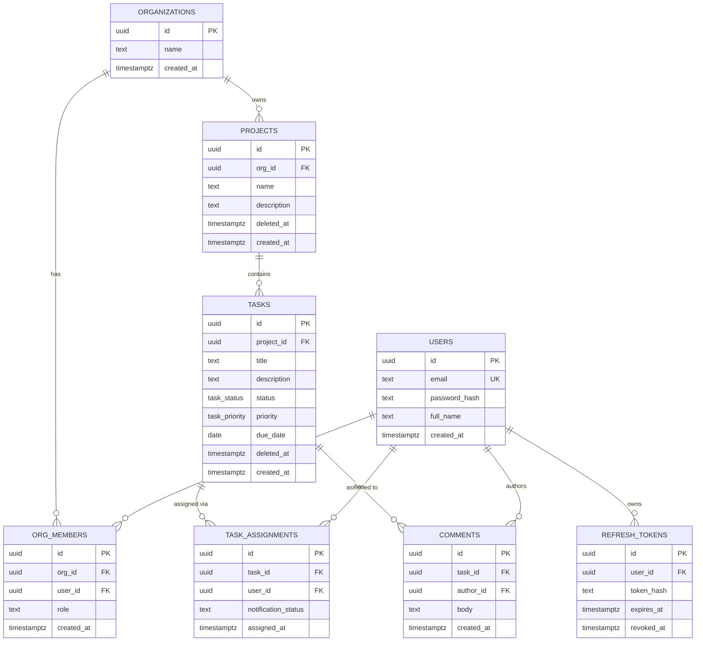

# TaskFlow — Database Design Document

All seven tables required by the assignment are covered below. Types use PostgreSQL syntax; ORM model definitions (Prisma) will mirror this 1:1.

## 1. Entity Relationship Overview



*(`refresh_tokens` is not one of the seven named tables in the PDF but is required to satisfy "store refresh tokens in DB with revocation support" from Task 02 — noted here as an implementation decision, not a re-statement of the seven-table list.)*

## 2. PostgreSQL Enums (exact values from the assignment)

```sql
CREATE TYPE task_status   AS ENUM ('todo', 'in_progress', 'review', 'done');
CREATE TYPE task_priority AS ENUM ('low', 'medium', 'high', 'urgent');
```

## 3. Table Definitions

### 3.1 `organizations`

| Column | Type | Constraints |
|---|---|---|
| id | uuid | PK, default `gen_random_uuid()` |
| name | text | NOT NULL |
| created_at | timestamptz | NOT NULL, default `now()` |

### 3.2 `users`

| Column | Type | Constraints |
|---|---|---|
| id | uuid | PK, default `gen_random_uuid()` |
| email | text | NOT NULL, **UNIQUE** |
| password_hash | text | NOT NULL (bcrypt, cost ≥ 12) |
| full_name | text | NOT NULL |
| created_at | timestamptz | NOT NULL, default `now()` |

### 3.3 `org_members` (join table: user ↔ org, carries role)

| Column | Type | Constraints |
|---|---|---|
| id | uuid | PK |
| org_id | uuid | FK → `organizations.id`, NOT NULL |
| user_id | uuid | FK → `users.id`, NOT NULL |
| role | text | NOT NULL, CHECK IN (`'org_admin'`, `'member'`) |
| created_at | timestamptz | NOT NULL, default `now()` |
| | | **UNIQUE (org_id, user_id)** — a user has exactly one role per org |

### 3.4 `projects`

| Column | Type | Constraints |
|---|---|---|
| id | uuid | PK |
| org_id | uuid | FK → `organizations.id`, NOT NULL |
| name | text | NOT NULL |
| description | text | NULL |
| deleted_at | timestamptz | NULL (bonus: soft delete) |
| created_at | timestamptz | NOT NULL, default `now()` |

### 3.5 `tasks`

| Column | Type | Constraints |
|---|---|---|
| id | uuid | PK |
| project_id | uuid | FK → `projects.id`, NOT NULL |
| title | text | NOT NULL |
| description | text | NULL |
| status | task_status | NOT NULL, default `'todo'` |
| priority | task_priority | NOT NULL, default `'medium'` |
| due_date | date | NULL |
| deleted_at | timestamptz | NULL (bonus: soft delete) |
| created_at | timestamptz | NOT NULL, default `now()` |

*Note: `tasks` does not carry `org_id` directly — the org is always reached via `tasks.project_id → projects.org_id`. This is deliberate normalization (see §7); every service-layer query joins through `projects` to apply the tenant filter.*

### 3.6 `task_assignments`

| Column | Type | Constraints |
|---|---|---|
| id | uuid | PK |
| task_id | uuid | FK → `tasks.id`, NOT NULL |
| user_id | uuid | FK → `users.id`, NOT NULL |
| notification_status | text | NOT NULL, default `'pending'` (`pending`/`enqueued`/`enqueue_failed`) — implementation column supporting §16 of `ARCHITECTURE.md` |
| assigned_at | timestamptz | NOT NULL, default `now()` |
| | | **UNIQUE (task_id, user_id)** — prevents duplicate assignment of the same user to the same task |

### 3.7 `comments`

| Column | Type | Constraints |
|---|---|---|
| id | uuid | PK |
| task_id | uuid | FK → `tasks.id`, NOT NULL |
| author_id | uuid | FK → `users.id`, NOT NULL |
| body | text | NOT NULL |
| created_at | timestamptz | NOT NULL, default `now()` |

### 3.8 `refresh_tokens` (supporting table, not in the required-seven list)

| Column | Type | Constraints |
|---|---|---|
| id | uuid | PK |
| user_id | uuid | FK → `users.id`, NOT NULL |
| token_hash | text | NOT NULL — the raw token is never stored, only a SHA-256/bcrypt hash |
| expires_at | timestamptz | NOT NULL (7 days from issue) |
| revoked_at | timestamptz | NULL — set on logout/rotation |
| created_at | timestamptz | NOT NULL, default `now()` |

## 4. CASCADE vs RESTRICT Decisions

| FK | On Delete | Justification |
|---|---|---|
| `org_members.org_id → organizations.id` | CASCADE | Deleting an org is a deliberate, rare admin action; its membership records have no meaning without the org. |
| `org_members.user_id → users.id` | CASCADE | A deleted user should not leave dangling membership rows. |
| `projects.org_id → organizations.id` | RESTRICT | Prevents accidental org deletion from silently wiping all project/task history; org deletion must be an explicit, deliberate cascade (or soft-delete) operation, not a side effect. |
| `tasks.project_id → projects.id` | CASCADE | A task cannot exist without its parent project; deleting a project should remove its tasks (paired with soft-delete in practice — see below). |
| `task_assignments.task_id → tasks.id` | CASCADE | An assignment is meaningless once its task is gone. |
| `task_assignments.user_id → users.id` | RESTRICT | Prevents deleting a user who still has active assignments without an explicit reassignment/offboarding step; protects audit trail. |
| `comments.task_id → tasks.id` | CASCADE | Comments belong entirely to their task's lifecycle. |
| `comments.author_id → users.id` | RESTRICT | Preserves comment history/authorship integrity; user deletion should not silently erase discussion history. |
| `refresh_tokens.user_id → users.id` | CASCADE | Tokens are meaningless without the user. |

**In practice**, because `projects` and `tasks` implement the bonus **soft-delete** (`deleted_at`), hard `DELETE` statements against them are rare in application code — "deletion" is normally a soft-delete UPDATE. The CASCADE/RESTRICT rules above describe the guaranteed behavior at the database level regardless of which code path performs the delete.

## 5. Indexes (and why each exists)

| Table | Index | Reason |
|---|---|---|
| `users` | UNIQUE(`email`) | Login lookup; also enforces uniqueness. |
| `org_members` | UNIQUE(`org_id`, `user_id`) | Enforces one role per user per org; also serves as the primary lookup for "is this user a member of this org." |
| `org_members` | INDEX(`user_id`) | Support "which orgs does this user belong to" queries (e.g. at login/JWT issuance). |
| `projects` | INDEX(`org_id`) | Every project list/lookup is filtered by org — the core tenant-isolation filter; this index is on the hot path of nearly every request. |
| `tasks` | INDEX(`project_id`) | Tasks are always listed/filtered within a project. |
| `tasks` | INDEX(`status`) | Required filter: filtering tasks by status. |
| `tasks` | INDEX(`priority`) | Required filter: filtering tasks by priority. |
| `tasks` | INDEX(`due_date`) | Required filter: due-date range filtering. |
| `tasks` | COMPOSITE INDEX(`project_id`, `status`) | Dashboard query (task counts grouped by status per project) is a covering-style composite lookup. |
| `task_assignments` | INDEX(`user_id`) | Required filter: "filter tasks by assignee" joins through this. |
| `task_assignments` | UNIQUE(`task_id`, `user_id`) | Prevents duplicate assignment rows; also indexes assignment lookups by task. |
| `comments` | INDEX(`task_id`) | Fetching a task's comment thread. |
| `refresh_tokens` | INDEX(`user_id`) | Support "revoke all tokens for user" (logout-all-devices bonus). |
| `refresh_tokens` | INDEX(`token_hash`) | Fast lookup on refresh. |

## 6. Unique Constraints Summary

- `users.email`
- `org_members(org_id, user_id)`
- `task_assignments(task_id, user_id)`

## 7. Multi-Tenant Data Ownership Model

- **Root of tenancy**: `organizations`.
- **Directly owned by org**: `org_members`, `projects`.
- **Transitively owned by org** (via `project_id → projects.org_id`): `tasks`.
- **Transitively owned by org** (via `task_id → tasks.project_id → projects.org_id`): `task_assignments`, `comments`.
- Every repository method that reads/writes a transitively-owned row performs an **inner join back to `projects.org_id`** and compares it against the authenticated caller's `org_id` (see `ARCHITECTURE.md` §14). No table below `organizations` is ever queried by primary key alone.

## 8. Migration Strategy

- Schema is defined and evolved exclusively through timestamped migration files (Prisma Migrate / TypeORM migrations / node-pg-migrate — whichever ORM is chosen, see `DECISIONS.md`), **never** a hand-maintained `schema.sql`, per the assignment's explicit requirement.
- Each migration includes both the forward change and, where the tool supports it, a documented down/rollback path.
- Migrations run automatically on container startup in development (`docker-compose` entrypoint) and are run explicitly (`npm run migrate:deploy`) in any production-like environment — never auto-applied silently in prod.

## 9. Seed Data Strategy

A single idempotent seed script (`prisma/seed.ts` or equivalent) populates the minimum data set required by the assignment:

- **2 organizations**
- **5 users** (distributed across the 2 orgs, at least one `org_admin` per org)
- **Multiple projects** (at least 2 per org)
- **10+ tasks**, distributed across projects, with a mix of all 4 statuses and all 4 priorities
- **Assignments** linking several tasks to users within the *same* org as the task
- **Sample comments** on several tasks

Passwords for seeded users are bcrypt-hashed at seed time (never stored in plaintext), and seed credentials are documented in the README for local testing only — never real credentials.

## 10. Optional / Bonus Database Features

These are explicitly called out as bonus in the PDF and are **not** required for a passing submission:

- ★ Soft delete via `deleted_at` on `projects` and `tasks` (modeled above; queries must filter `deleted_at IS NULL` by default).
- ★ PostgreSQL full-text search on `tasks.title` + `tasks.description`, e.g. via a generated `tsvector` column and a GIN index:

```sql
ALTER TABLE tasks ADD COLUMN search_vector tsvector
  GENERATED ALWAYS AS (to_tsvector('english', coalesce(title,'') || ' ' || coalesce(description,''))) STORED;
CREATE INDEX idx_tasks_search ON tasks USING GIN (search_vector);
```
